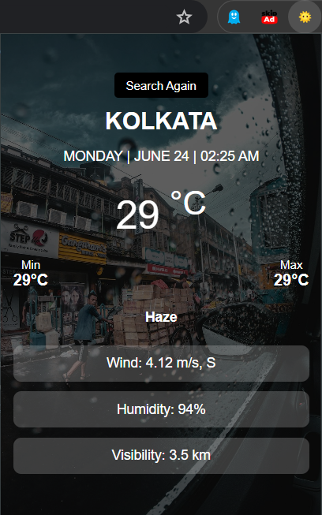

# Cloudburst Weather Chrome Extension
## Overview
Cloudburst is a simple and elegant Chrome extension that provides current weather information for any city. It uses the OpenWeatherMap API to fetch weather data and the Unsplash API to display a relevant background image of the searched city.

## Features
* Fetches and displays current weather information including temperature, minimum and maximum temperatures, wind speed and direction, humidity, and visibility.
* Displays a relevant background image of the searched city using the Unsplash API.
* Provides an easy-to-use search interface for quick weather lookups.


## Prerequisites
Before you begin, ensure you have met the following requirements:

+ You have a modern web browser (preferably Google Chrome).
+ You have a Google Chrome account to install the extension.
+ You have an API key from OpenWeatherMap.
+ You have an API key from Unsplash.
## Installation
1. Clone the repository or download the source code.
2. Open Chrome and navigate to ```'chrome://extensions/'```.
3. Enable "Developer mode" by toggling the switch in the top right corner.
4. Click on "Load unpacked" and select the directory containing the extension source code.
## File Structure

```plaintext
cloudburst-extension/
│
├── icons/
│   └── weather.png
│
├── styles/
│   ├── popup.css
│   └── weather.css
│
├── scripts/
│   ├── background.js
│   └── weather.js
│
├── weather.html
├── manifest.json
└── README.md
```

## Configuration
* **OpenWeatherMap API Key:** Replace the placeholder ```a08955ad82d15f896550dbf7ebe9007b``` in ```weather.js``` and ```background.js``` with your actual OpenWeatherMap API key.
* **Unsplash API Key:** Replace the placeholder ```4Bs-E9oI_yQJMQFW7TB-AT0QXb4dh3IXjGI_4XzaZgY``` in ```weather.js``` and ```background.js``` with your actual Unsplash API key.
## Usage
1. Click on the Cloudburst icon in the Chrome toolbar to open the popup.
2. Enter the name of the city in the search bar and click "Search".

## Here are some demo images:

### Image 1: 


### Image 2:


### Image 3:


### Image 4:


### Image 5:


### Image 6:


